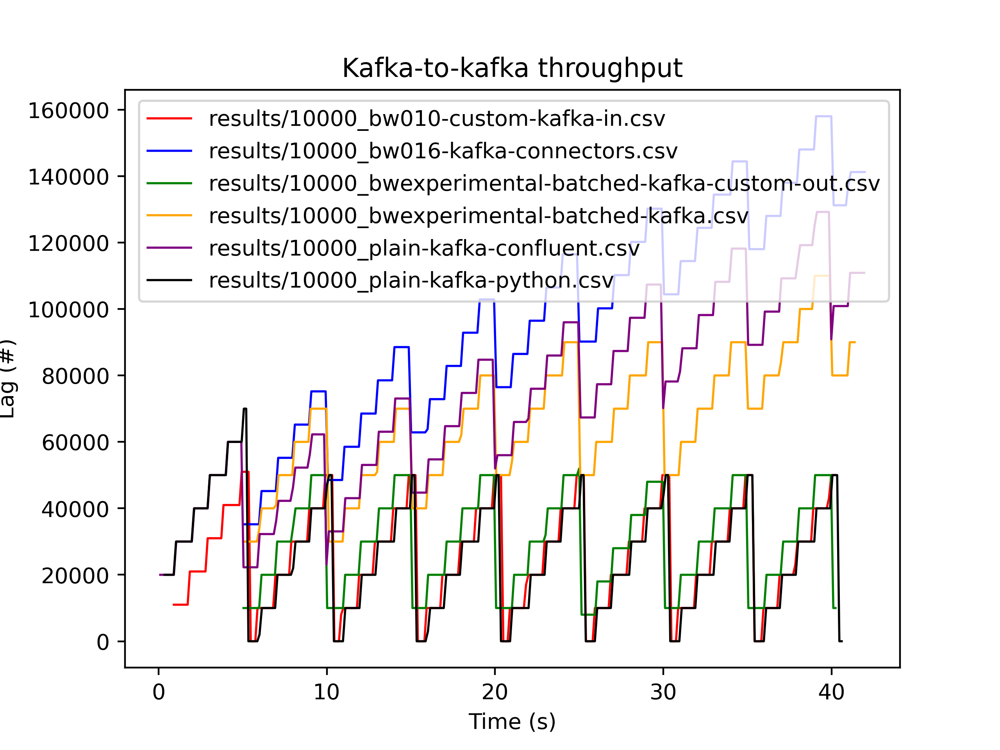

# Kafka-to-Kafka throughput benchmarks

Benchmarks for kafka to kafka throughput with various versions of bytewax, compared with a plain python script.
In the benchmark we actually use `redpanda`, a kafka compatible streaming data platform, for ease of local deployment,
but the benchmarks can be ran with a Kafka deployment if needed.

## Run the benchmarks

A `docker-compose.yml` file is given to setup local infrastructure.

To run the benchmarks, first run the redpanda cluster with:
```
docker compose up -d
```

Wait for the cluster to be up and running, you can check the redpanda console at `http://localhost:8080`.

Now prepare the virtualenvs with:
```
./prepare_envs.sh
```

Run the benchmarks with:
```
.venv/bin/python scripts/benchmark.py
```

Plot the benchmarks with:
```
.venv/bin/python scripts/plot.py results/10000_*.csv -o results/plot.png
```

## Add more benchmarks
To add one more file in the benchmark suite, either add a new python script to one of the existing folders in `src/`, or create a new folder if you need different dependencies.
If you create a new folder, you'll need to include a `requirements.txt` file with all the dependencies needed to run your script.

The included script will be passed the following environment variables:
- `GROUP_ID`
- `CONSUME_TOPIC`
- `PRODUCE_TOPIC`
- `BROKERS`

Once you added the files, add an entry into `config.toml`.  
The script is expected to run continuously, the benchmark process will kill it after having collected enough data.

## Results
### 10_000 messages per second produced

### 100_000 messages per second produced

